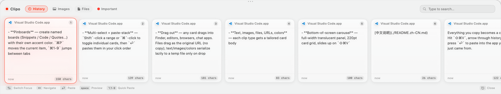
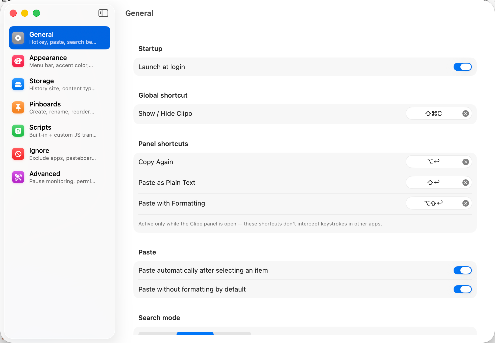

# Clipo

A Paste-style clipboard manager for macOS — horizontal card carousel at the bottom of the screen, built with SwiftUI + SwiftData.

<p align="center">
  
</p>

Everything you copy becomes a card. Hit `⇧⌘V`, arrow through history, press `⏎` to paste into the app you just came from.

[中文说明](./README.zh-CN.md)

## Features

- **Bottom-of-screen carousel** — full-width translucent panel, 220pt card grid, slides up on `⇧⌘V`
- **Text, images, files, URLs, colors** — each clip type gets a tailored card body
- **Drag out** — any card drags into Finder, editors, browsers, chat apps. Files drag as the original URL (no copy); text/images/colors serialize lazily to a temp file only on drop
- **Multi-select + paste-stack** — `Shift`-click a range or `⌘`-click to toggle individual cards, then `⏎` pastes them in your click order
- **Pinboards** — create named boards (Snippets / Code / Quotes…) with their own accent color. `⌘P` moves the current item, `⌘1-9` jumps between tabs
- **Search** — exact / contains / fuzzy modes, highlights matches inline
- **OCR on images** — screenshots become searchable by their contents (Vision framework, off-main)
- **Scripts** — user-defined JavaScript transforms (trim whitespace, format JSON, URL-decode…) exposed in the card right-click menu
- **Ignore rules** — per-app, per-pasteboard-type, or per-regex patterns keep passwords and secrets out of history
- **`clipocli` CLI** — installed alongside the app, lets you query/paste from scripts and shell

## Requirements

- macOS 14 Sonoma or later
- Accessibility permission (needed to inject `⌘V` into the frontmost app)

## Install

### Download DMG

Grab the latest `Clipo-*-arm64.dmg` from [Releases](https://github.com/17307/clipo/releases), drag `Clipo.app` into `/Applications`, and launch it. Grant Accessibility permission when prompted.

### Build from source

```bash
# Generate the Xcode project (uses XcodeGen; install via brew if missing)
brew install xcodegen
xcodegen

# Debug build
xcodebuild -project Clipo.xcodeproj -scheme Clipo -configuration Debug build

# Release DMG in one shot (clean → build → package → open in Finder)
bash scripts/package.sh

# Apple-Silicon-only build (matches the CI workflow output)
ARCHS=arm64 bash scripts/package.sh
```

## Keyboard Reference

| Shortcut | Action |
|---|---|
| `⇧⌘V` | Open / close the panel |
| `← →` | Navigate cards |
| `⏎` | Paste selected card into the frontmost app |
| `Space` | Open preview |
| `⌥1–⌥9` | Quick-paste the Nth visible card |
| `⌘1–⌘9` | Switch filter / pinboard tab |
| `Shift`-click / `⌘`-click | Extend / toggle multi-selection |
| `⌘A` | Select all visible cards |
| `⌫` | Delete current (or multi-selection) |
| `Esc` | Close panel (or clear multi-selection first) |
| `⌘,` | Open Settings |
| `⇧⏎` | Paste as plain text |
| `⌥⏎` | Copy selected card back to system clipboard |
| `⌥⇧⏎` | Paste with formatting preserved |

## Settings

Everything user-facing is configurable via the `⌘,` Settings window — split across seven panes: **General** (hotkeys, paste defaults, search mode), **Appearance** (menu bar icon, accent color, panel dimensions), **Storage** (history size, per-type toggles, sort order), **Pinboards**, **Scripts**, **Ignore** (apps / pasteboard types / regex patterns), and **Advanced** (pause monitoring, accessibility status, diagnostics).

<p align="center">
  
</p>

## Architecture

- **UI**: 100% SwiftUI inside a borderless `NSPanel` anchored to the bottom edge
- **Storage**: SwiftData with a single `ModelContainer` under `~/Library/Application Support/Clipo/Storage.sqlite`
- **Clipboard engine**: `NSPasteboard.changeCount` polling at 0.5s (configurable), type whitelist, internal marker to prevent paste loops
- **Paste**: `CGEvent`-injected `⌘V` into the frontmost app (Maccy's approach)
- **Scripts**: `JavaScriptCore` sandbox, 500ms timeout per invocation, one `JSContext` per script for isolation
- **Drag-out**: SwiftUI `.onDrag` with `NSItemProvider.registerDataRepresentation` lazy file-URL loader, panel fades during drag to keep compositing cost off the critical path
- **Search**: [Fuse-swift](https://github.com/krisk/fuse-swift) for fuzzy matching; debounced per-keystroke

### Directory layout

```
Clipo/
├── App/             # AppDelegate, status bar, drag lifecycle
├── Clipboard/       # ClipboardEngine, Paster, Accessibility prompt
├── Hotkeys/         # Global + window-local shortcut registration
├── IPC/             # clipocli bridge (Unix-socket server)
├── Models/          # ClipItem, ClipContent, Pinboard (SwiftData)
├── Scripts/         # JS script runtime + built-in examples
├── Settings/        # 7 preference panes
├── State/           # AppState (@Observable, MainActor-bound)
├── Storage/         # SwiftData ModelContainer
└── UI/              # Panels, carousel, cards, design tokens
```

### SPM dependencies

- [`Defaults`](https://github.com/sindresorhus/Defaults) — type-safe `UserDefaults`
- [`KeyboardShortcuts`](https://github.com/sindresorhus/KeyboardShortcuts) — user-rebindable hotkeys
- [`Settings`](https://github.com/sindresorhus/Settings) — preferences window toolbar
- [`LaunchAtLogin`](https://github.com/sindresorhus/LaunchAtLogin-Modern) — login-item toggle
- [`Fuse`](https://github.com/krisk/fuse-swift) — fuzzy search

## Privacy

- Everything stays local. No network calls, no telemetry, no iCloud.
- `~/Library/Application Support/Clipo/Storage.sqlite` holds all history.
- Sensitive items marked `.concealed` or `.autoGenerated` (password managers, Keychain, etc.) are skipped automatically.
- Apple's **Passwords.app** and **Keychain Access** are ignored by bundle ID out of the box; add more apps or regex patterns in Settings → Ignore to exclude other sources.

## Credits

Inspired by [Paste](https://pasteapp.io/) (UI) and [Maccy](https://github.com/p0deje/Maccy) (clipboard engine).
